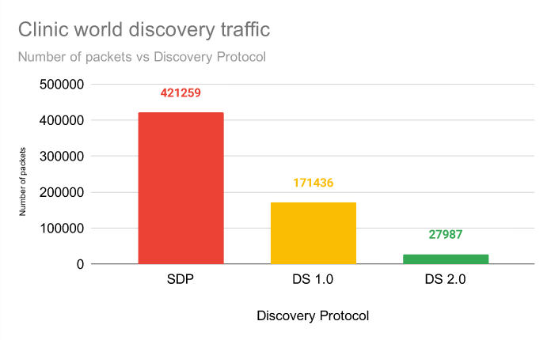

# Tesi Magistrale
`
🟢 CHECKED
🟡 TO-CHEKC-FURTHER
🟣 TODO
🔴 NOT-DOABLE
⚫ NEED-HELP
`

Post-Call Update
- 🟢 **Can the same app be subscribed to different domains?**
    Yes, I tested this morning and a single subscriber node (pure FastDDS, not using ROS) is able to subscribe (and consequently publish) to two different topics on two different DomainIDs.

- 🟢**How does ROS2 define topics and data types?**
 
    ROS2 has its own extensive library of supported type_msg. For example: ```geometry_msgs/msg/Accel.msg, geometry_msgs/msg/AccelStamped.msg, geometry_msgs/msg/AccelWithCovariance.msg, geometry_msgs/msg/AccelWithCovarianceStamped.msg, geometry_msgs/msg/Inertia.msg, geometry_msgs/msg/InertiaStamped.msg, geometry_msgs/msg/Point.msg, geometry_msgs/msg/Point32.msg, geometry_msgs/msg/PointStamped.msg, geometry_msgs/msg/Polygon.msg, geometry_msgs/msg/PolygonStamped.msg, geometry_msgs/msg/Pose.msg``` and so on. This is just for the geometry_msgs package. Additionally, under the rwm_implementation, in my understanding, everything is basically serialized/deserialized.

- 🟢 **Verify communication overhead as the number of subscribers increases.**

    From the call, it seems that a distributed approach is preferable rather than having a server for the discovery phase. This approach does not have overhead issues once the network is online and all nodes are connected. However, regarding the discovery phase, it is widely discussed that a distributed approach creates significant problems as the number of nodes increases: "as the number of exchanged packets increases significantly as new nodes are added." So, every time a node is added with a large number of nodes (>500), it will definitely stress the network. 
    
    650 nodes (SDP: Distributed; DS 1/2: Server v1/2 ).We are able to use also DS2.0: 


- 🟡 **Regarding verifying which entities are connected on a specific topic at a specific moment.**

    I heard there was talk of checking if there was an entity x on a topic else y would take over. Verifying which entities is listening (both publishers and subscribers) to a topic is a non-trivial process. When testing in ROS2 (and this is why i believe it is also not possible in FastDDS), it is not possible to know at runtime who is connected to a topic at a FastDDS level (such as NodeManager instead of JobManager, Countdown, EAR, etc.). However, it is possible to know the number of connected nodes (#sub #pub #totsub_ever_connected #totpub_ever_connected and maybe only the UID), but identification is not performed. ROS2 offers a higher-level tool that provides a graph view of which nodes are publishers and subscribers to a topic, and I think this is done using a higher-level event-driven structure (ROS's structure).

    Based on what I've thought, it would be possible to work around this concept in at least these ways:

  - Identifying publishers (subscribers cannot be identified) in the messages they send. When messages are exchanged, a structure is defined to be exchanged, and this structure can include a field like <char[] id = "JobManagerX">.
  - Having multiple topics (e.g., JobManagerTopic, etc.) where our physical node subscribes to multiple topics. It would be possible for the node to know if there are connected subscribers to those topics and gather information from where at least one subscriber is present.

-  🟡 **How to manage real-time pull messages?**

    I'm not sure if I understood correctly.

- 🟡 **How can we leverage partitions to create hierarchies of topics?**

- 🟡 **Understand the flexibilities introduced by domains and partitions in topic based communications?**

- 🟣 **Evaluate the cost of #publish subscribers.**


