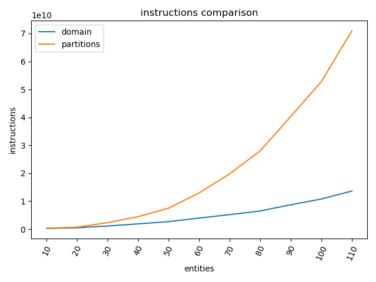
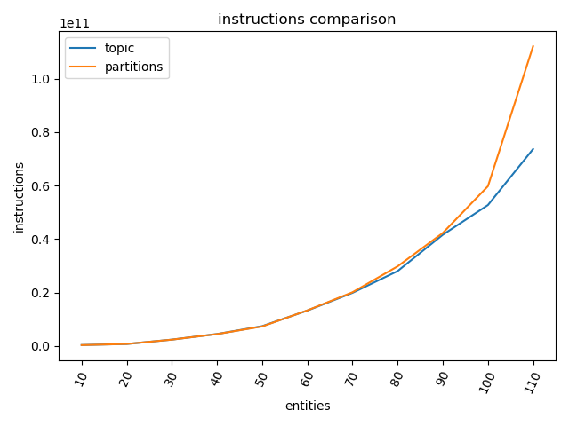
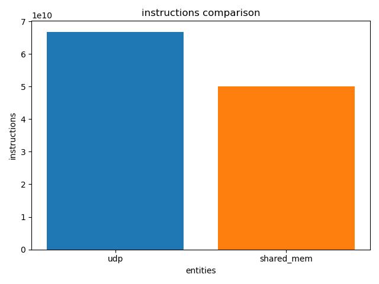

# Weekly Update 
## Table of content
1. [28/07](#{28-07})
2. [04/08](#04-08)

## 28-07
Several tests have been performed using `perf`. These tests consist of the simultaneous instantiation of $N(3)$ different communication "groups", each with $TOT_ENTITIES/N$ entities (TOT_ENTITIES in this case was tested with 110). Each of these "groups" was compared using 2 out of the 3 available approaches at time:

- Changing `topic` name
- Changing `domainID`
- Changing `partitions`

As a result, a substantial difference was observed as the instances grew, with the domainID proving to be the most efficient (as expected) compared to the other two approaches. On the other hand, when it comes to topic and subscription, using two "groups" requires the same resource expenditure. Considering all methods, the most efficient ways to divide the communication groups are:

1. Different `domainID`: However, note that changing it at runtime poses significant challenges.
2. Different `partitions`: They are more flexible for runtime changes and allow a single entity to participate in multiple partitions, even with hierarchy.
3. Different `topics`: Since it consumes resources similarly to partitions, the limitation is that subscribing to multiple topics requires multiple entities for sub/pub.

Un'alto passaggio è stato fatto andando ad analizzare shared_mem e tcp/udp transport layer, e si è visto come sia in termini di performance, che in termini di pacchetti scambiati (0 per shared_mem) la shared memory è preferibile

### Multicast communication
By default, every time a DataWriter publishes a data change on a Topic, it sends a unicast message for every DataReader that is subscribed to the Topic. If there are several DataReaders subscribed, it is recommendable to use multicast instead of unicast. See: https://fast-dds.docs.eprosima.com/en/latest/fastdds/use_cases/many_subscribers/many_subscribers.html#use-case-manysubscribers
### Realtime communication
https://fast-dds.docs.eprosima.com/en/latest/fastdds/use_cases/realtime/realtime.html

---
## 04-08